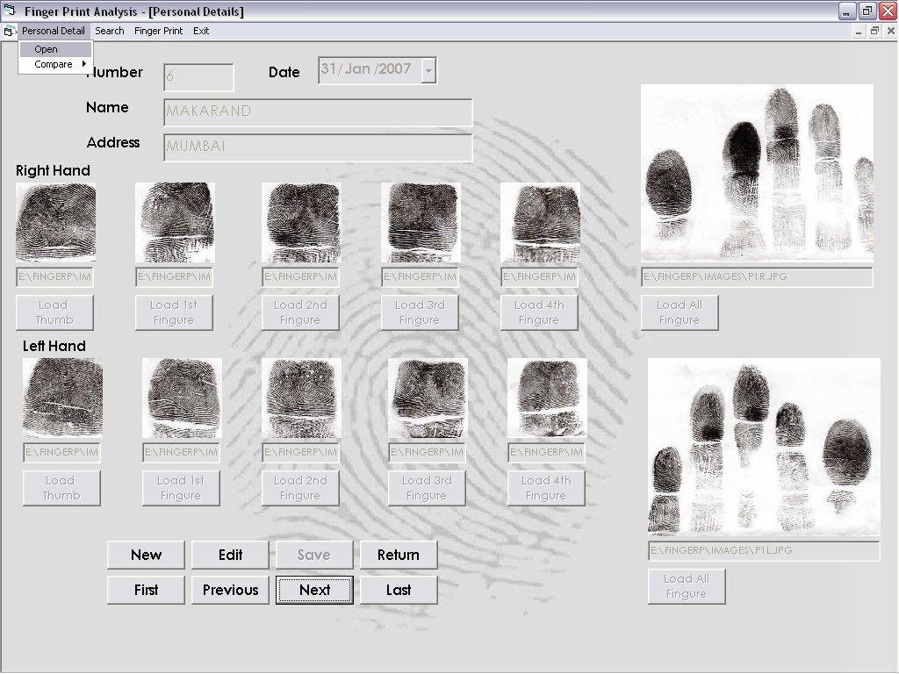



## FuingurePrintAnalysis

### Description

It is a project developed at our organization for comparing two persons fingure prints are identical or not. can be used in security systems, it had got capability to inert new records to the project, can be upgraded with new human interface device attachments for caputuring the images for getteing the images for live comparision
 
### More Info
 

             |
---                |---
**Submitted On**   |2009-04-11 01:35:46
**By**             |[Vishwanet Computers Pvt\. Ltd, Kolhapur](https://github.com/Planet-Source-Code/PSCIndex/blob/master/ByAuthor/vishwanet-computers-pvt-ltd-kolhapur.md)
**Level**          |Advanced
**User Rating**    |4.5 (18 globes from 4 users)
**Compatibility**  |VB 6\.0
**Category**       |[Complete Applications](https://github.com/Planet-Source-Code/PSCIndex/blob/master/ByCategory/complete-applications__1-27.md)
**World**          |[Visual Basic](https://github.com/Planet-Source-Code/PSCIndex/blob/master/ByWorld/visual-basic.md)
**Archive File**   |[FuingurePr21929411152010\.zip](https://github.com/Planet-Source-Code/vishwanet-computers-pvt-ltd-kolhapur-fuingureprintanalysis__1-73592/archive/master.zip)

